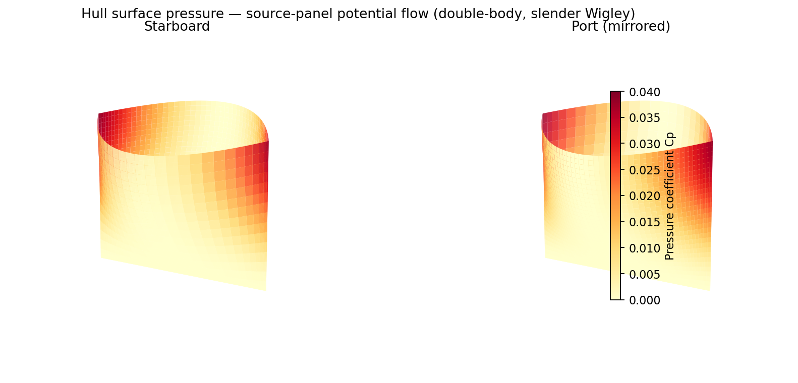
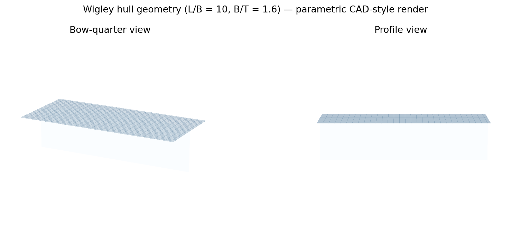
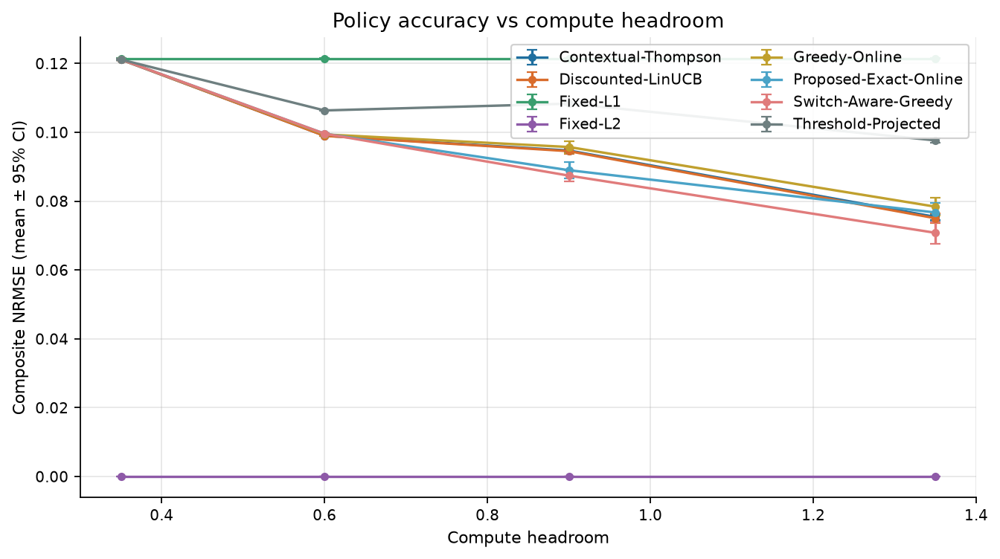
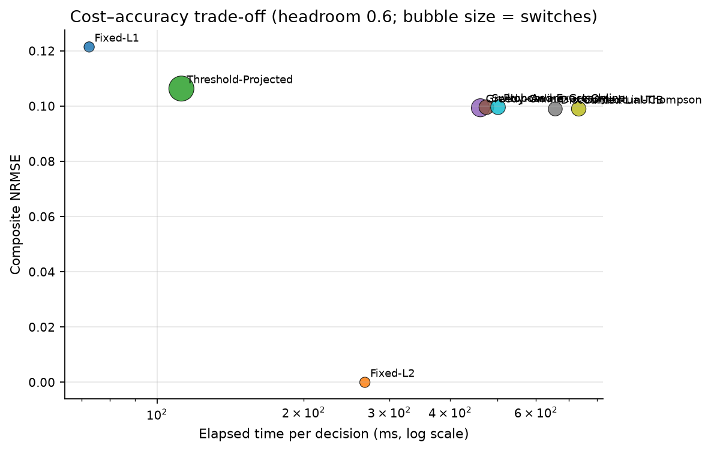
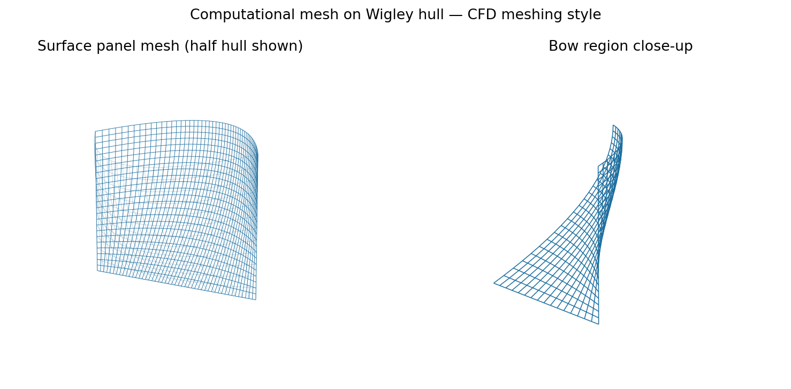
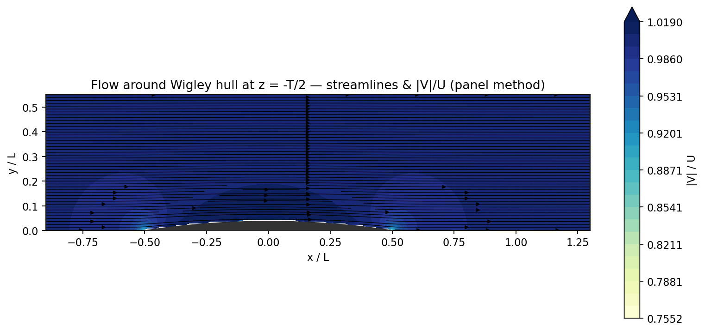
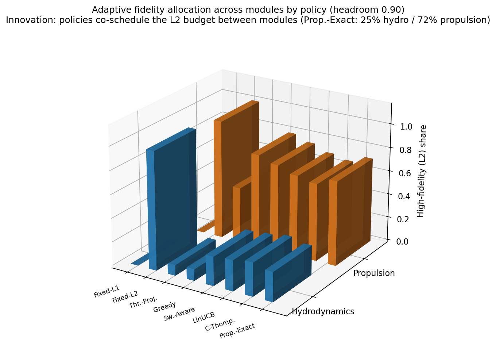

# 单工作站船舶数字孪生：自适应多保真协同仿真

## 效果展示

  
  

研究在计算预算下分配水动力与推进模块的在线保真度，并比较误差、切换和整体运行开销。

## 问题与方法

面向有限计算预算，在水动力与推进模块的 L1/L2 保真度组合间选择，权衡估计误差收益、模型调用成本与切换惩罚。以两模块四种组合的单步枚举器为主方法，加入原贪心、同规则切换感知贪心、Discounted LinUCB、Contextual Thompson 等八种策略。Exact 指有限动作集合上的单步枚举，不是未来全局最优策略。

最新统一实验：四预算档、四生成工况、八个 ROM 试验簇、每配置两次计时；**2,048 次策略运行＋64 次直接全 L2 计时**。场景和重复先在 ROM 簇内平均，不把时间步或运行数量当独立样本。

## 可运行内容

在根目录执行 `python src/demo.py && python src/verify.py`。

- 原 `CostProfile` 和 `SwitchAwareEnumerativeAllocator` 核心类提取版，演示预算突降时强制改为可行组合。
- 从原逐次运行表复算 32 组配置的 256 项指标均值及 16 项配对误差差值。
- 上述紧凑入口从已存 p 值检查 Holm；v0.4 新增原研究引擎，独立从逐次记录重算 Student t 区间、p 值与两组 Holm 校正，共 931 项统计值一致。
- 新增实际耦合仿真：重新生成 48 工况数据库并训练 POD，执行 900 步、八策略与四预算共 32 次运行；11 项原始测试通过。命令见 [引擎说明](engine/README.md)。冻结校准先验和成本被复用，不把这组检查冒充完整盲测。

## 必须保留的结果

0.90 预算档枚举器相对原贪心、LinUCB、Thompson 的误差降低有校正后支持；0.60 档上下文策略更好。同规则贪心在前两个预算档与枚举器误差相同，在 1.35 档优于枚举器 **0.590 个百分点**。

直接全 L2 已存均值 **216.4 ms/900 步**；枚举器 **348.5–701.7 ms**。模型调用额度违规率为零，仍不能写成端到端加速、OS 算力限制或硬实时满足。

当前 ROM 和推进参数为合成/工程估计，公共阻力参考回放不是重新运行 CFD。六点阻力来源已纠正为 TOKYO’15 rescaled；不存在的新 CFD case、时程、网格验证或旧逐种子回放数据不补造。本版已恢复完整统一主实验程序依赖链和新运行入口，但本次只执行了 32 次代表性仿真，没有重新执行全部 2,048 次实验，也没有补造 CFD 证据。

本项目展示预算分配实现、强对照、开销审计和适用边界研究；

## Figures

Regenerate with `python figures/make_figures.py` (needs `matplotlib`, `pandas`, `numpy`).

### 3D illustrations of the hydrodynamic simulation context

The four figures below illustrate the ship-hydrodynamics context of this
project's simulation module. They are **not numerical results of the research
project itself** - do not cite them as project findings.

Computed in Python (no commercial CFD): parametric Wigley hull (L/B=10, B/T=1.6),
low-order Rankine source-panel method in double-body potential flow for surface
pressure and streamlines. Regenerate with `python figures/make_hull_figures.py`
(needs `matplotlib`, `numpy`; ~1 min). Not RANS results, not Fluent/StarCCM output.

*Innovation in 3D: adaptive policies co-schedule the L2 budget between hydrodynamics and propulsion modules (headroom 0.90, from data/summary.csv). Regenerate with `python figures/make_hull_figures.py`.*
